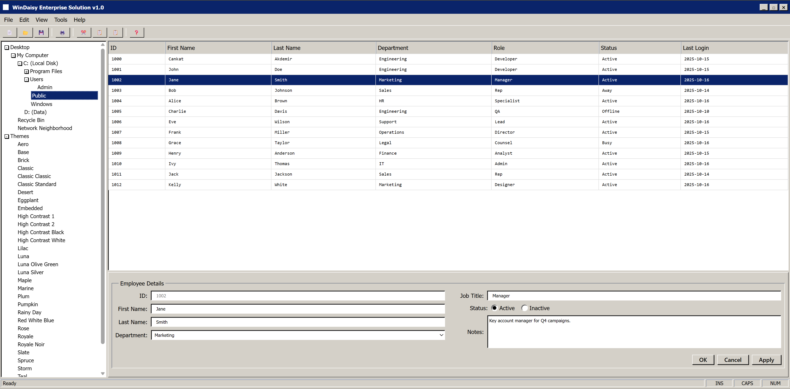

# WinDaisy

A collection of [daisyUI](https://daisyui.com/) themes that replicate classic Windows color schemes.



This project provides CSS files that can be used to theme your application to look like older versions of Windows. See a live demo in `index.html`.

While hunting for an old Windows color scheme for my blog, I found [this gist](https://gist.github.com/zaxbux/64b5a88e2e390fb8f8d24eb1736f71e0) from [@zaxbux](https://github.com/zaxbux). I wanted to see how they'd actually look, so I tried creating an **old-school LOB application UI** with a popular CSS framework. What I thought would be 'a couple of hours of tinkering' took over the first two weeks of 2026.

## Available Themes

There are 33 themes available:

-   `aero`
-   `base`
-   `brick`
-   `classic`
-   `classic-classic`
-   `classic-standard`
-   `desert`
-   `eggplant`
-   `embedded`
-   `high-contrast-1`
-   `high-contrast-2`
-   `high-contrast-black`
-   `high-contrast-white`
-   `lilac`
-   `luna`
-   `luna-olive-green`
-   `luna-silver`
-   `maple`
-   `marine`
-   `plum`
-   `pumpkin`
-   `rainy-day`
-   `red-white-blue`
-   `rose`
-   `royale`
-   `royale-noir`
-   `slate`
-   `spruce`
-   `storm`
-   `teal`
-   `wheat`
-   `windows`
-   `zune`

## Getting Started

This project uses [Bun](https://bun.sh/) for package management and [Tailwind CSS](https://tailwindcss.com/) with the [daisyUI](https://daisyui.com/) plugin.

### Installation

1.  Clone the repository:
    ```sh
    git clone https://github.com/cnkt/WinDaisy.git
    cd WinDaisy
    ```

2.  Install dependencies:
    ```sh
    bun install
    ```

### Usage

1.  Build the CSS:
    ```sh
    bun run build
    ```
    This command processes the `input.css` file, which imports all the themes, and generates the `output.css` file.

2.  Link the CSS file in your HTML:
    ```html
    <link href="./output.css" rel="stylesheet">
    ```

3.  Apply a theme by setting the `data-theme` attribute on the `<html>` tag or any other element:
    ```html
    <html data-theme="classic">
      <!-- Your content here -->
    </html>
    ```

## Contributing

Contributions are welcome. If you find any issues with the themes or want to add a new one, please open a pull request.

### Editing a Theme

1.  Locate the theme's directory under `themes/`.
2.  Edit the `theme.css` file.
3.  Rebuild the CSS to see your changes:
    ```sh
    bun run build
    ```
4.  Open `index.html` in your browser to preview the changes.

### Adding a New Theme

1.  Create a new directory for your theme under the `themes/` directory.
2.  Inside your new theme's directory, create a `theme.css` file.
3.  Define your theme's colors using CSS variables within a `data-theme` selector. For example:
    ```css
    [data-theme="your-theme-name"] {
      --primary: #0078d7;
      --secondary: #f0f0f0;
      /* ... other daisyUI color variables */
    }
    ```
4.  Import your new `theme.css` file in `input.css`:
    ```css
    @import "./themes/your-theme-name/theme.css";
    ```
5.  Rebuild the CSS:
    ```sh
    bun run build
    ```
6.  Add your new theme to the theme switcher in `index.html` to test it.

## License

This project is licensed under the MIT License. See the [LICENSE](./LICENSE) file for details. You can fork and do whatever you want with it.